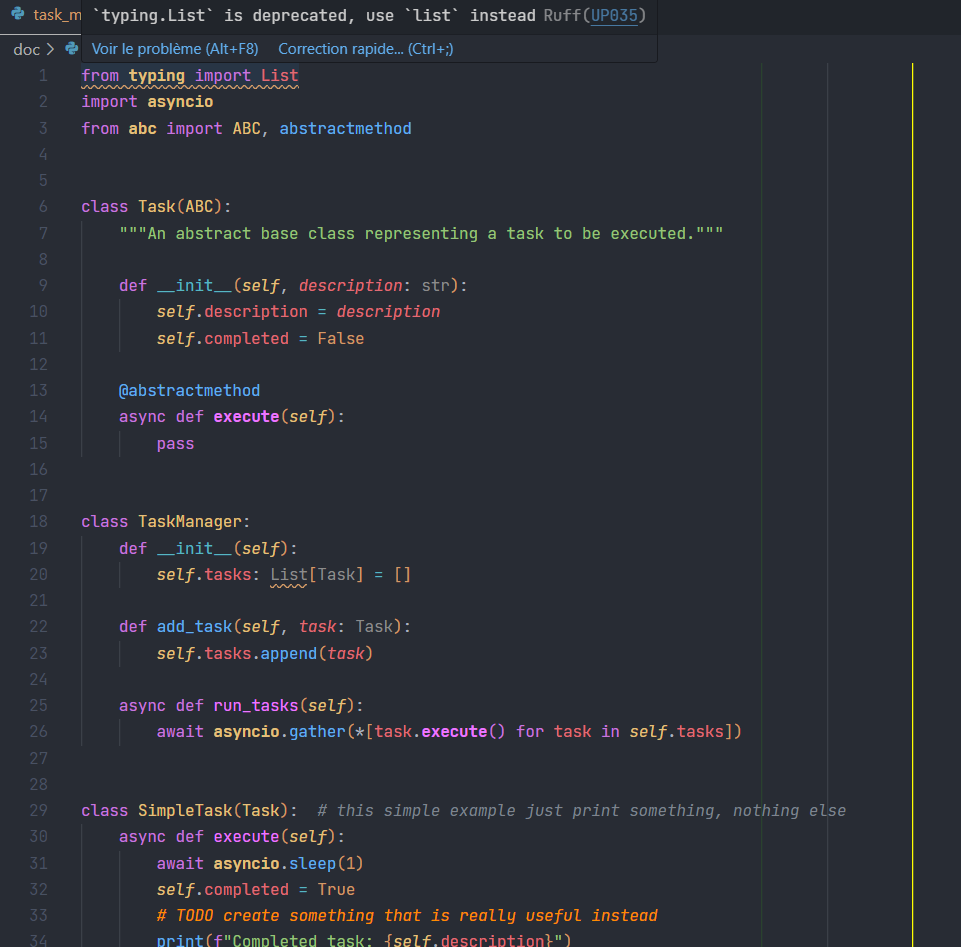
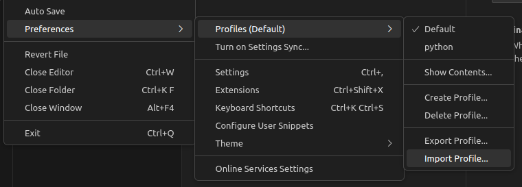

# VS Code Python Profile with complete settings
A python profile with a lot of settings and a full theme already configured. The theme used is `One Dark Pro` with some additional features.


## Screenshot


## Installation

1. Navigate to: **File > Preferences > Profiles > Import Profile...**


1. Paste the link: https://raw.githubusercontent.com/arnaud-ma/vscode_profile/main/profile/Python.code-profile

It is recommended to install the [Jetbrains mono font](https://github.com/JetBrains/JetBrainsMono#installation)

## Configuration

### Settings

The settings are configured in the [`settings.json`](profile/settings.json) file. You can read the file to see the settings that are already configured.
To modify your own settings, you can navigate to **File > Preferences > Settings** and search for the setting you want to change.

Click on the little icon on the right (Open Settings (JSON)) if you want to directly modify your own `settings.json` file.

For example, if you want to change the font, you can either:
 - search "font" in the settings and change the font family
 - change the `editor.fontFamily` setting in the `settings.json` file. It should be located in the font / writing style section.

Ligatures are disabled by default. To enable them, search for "ligature" in the settings then change the `editor.fontLigatures` setting to `true`.

### Ruff / black configuration

Unfortunately there can be many problems putting ruff settings directly into the `settings.json` file and applying those settings for any workspace. What you can do instead is to add a `pyproject.toml` file at the root of your project with all the settings you want. \
A template file could be :

<details>
<summary>pyproject.toml</summary>
<p>

```toml
[tool.black]
# should be same as ruff
line-length = 88

[tool.ruff]
# should be same as black
line-length = 88

# https://beta.ruff.rs/docs/rules/
select = [
    "E",    # pycodestyle
    "F",    # pyflakes
    "N",    # pep8-naming
    "W",    # warnings (indentation, line length, etc.)
    "UP",   # pyupgrade
    "S",    # bandit
    "B",    # bugbear
    "COM",  # commas
    "C4",   # comprehensions
    "EM",   # error messages
    "RET",  # returns
    "RSE",  # raise statements
    "Q003", # quotes
    "SLF",  # private methods
    "SIM",  # simplify
    "TCH",  # type checking
    "PL",   # pylint
]

ignore = [
    "E501",   # line too long
    "F841",   # unused variable
    "RET505", # unnecessary `else` after `return` statement
    "COM812", # trailing comma (conflict with black formatter)
    "B905",   # no strict in zip
    "S311",   # random number generator not cryptographically strong
    "S101",   # use of assert detected
    "SLF001", # private member access
]

exclude = [
    ".bzr",
    ".direnv",
    ".eggs",
    ".git",
    ".git-rewrite",
    ".hg",
    ".mypy_cache",
    ".nox",
    ".pants.d",
    ".pytype",
    ".ruff_cache",
    ".svn",
    ".tox",
    ".venv",
    "__pypackages__",
    "_build",
    "buck-out",
    "build",
    "dist",
    "node_modules",
    "venv",
]

# exclude some rules in the __init__.py files
[tool.ruff.extend-per-file-ignores]
"__init__.py" = ["F401"] # unused import

[tool.ruff.pydocstyle]
# https://beta.ruff.rs/docs/settings/#pydocstyle-convention
convention = "google"

[tool.ruff.flake8-quotes]
inline-quotes = "double"
multiline-quotes = "double"
docstring-quotes = "double"


[tool.ruff.pylint]
max-args = 5

[tool.pyright]
# deactivate pyright features that are already covered by ruff
# only activate type checking actually
typeCheckingMode = "basic"
stubPath = "typings"
reportGeneralTypeIssues = true
reportMissingTypeStubs = false
reportUndefinedVariable = false
reportUnusedVariable = false
reportUnusedClass = false
reportUnusedFunction = false
```
</p>
</details>

## Extensions

- `Python` - Python extension for Visual Studio Code.
- `Pylance` - Fast, feature-rich language support for Python, including the pyright static type checker.
- `Python environement manager` - Browse and manage all of your Python environments & packages from a single place.
- `Black formatter` -  Support for the [Black](https://github.com/psf/black) formatter.
- `Ruff` - Support for the [Ruff](https://beta.ruff.rs/docs/) linter.
- `Python indent` - Correct python indentation in VS Code.
- `autoDocstring` - Automatically generates docstrings.
- `Even Better TOML` - TOML file support, for project config setup files like `pyproject.toml`.
- `Todo Tree` - Searches your workspace for comment tags like TODO and FIXME, and displays them in a tree view in the activity bar.
- `Better Comments` - Create more human-friendly comments in your code.
- `Code Spell Checker` - A basic spell checker that works well with code and documents.
- `One Dark Pro` - Atom's iconic One Dark theme.

## Theme

The theme used is `One Dark Pro`. Some features are added in the `settings.json` file :

- The JetBrains mono font is used if installed, with ligatures
- Module import are bolded
- Abstract methods are bolded
- Everything related to annotation is of a different color (close to the comments one)
- async function are of a different color

For even more customization, you can add (only need to install in VS Code) :

- a file icon theme like [Material icon theme](https://marketplace.visualstudio.com/items?itemName=PKief.material-icon-theme)
- a product icon theme like [Fluent icons](https://marketplace.visualstudio.com/items?itemName=miguelsolorio.fluent-icons)

## Settings

You can read the [`settings.json`](profile/settings.json) file to see the settings that are already configured.

## Key bindings

- `ctrl+enter` - Run the python file
- `ctrl+t` - Toggle the terminal
- `ctrl+shift t` - Open a new terminal
- `ctrl+k` - If focus on the terminal, clear it
- `alt+d` - Add word to dictionary
- `f4` - Go to the reference
