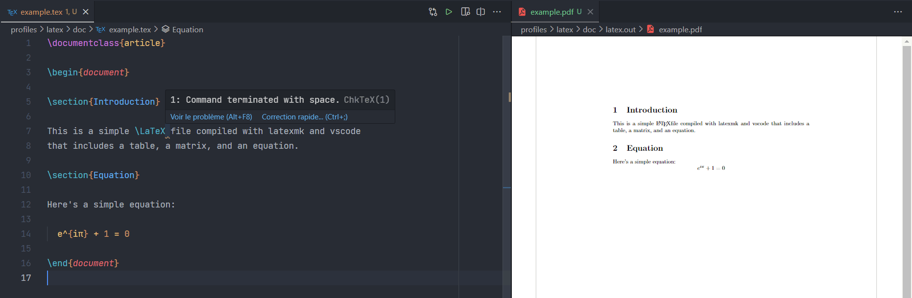

# Latex profile for VS Code

A latex profile that includes:

- Automatic build with the ctrl+alt+b shortcut
- A linter, a formatter and a grammar / spell checker
- Automatic snippets for common latex commands

[Screenshot](#screenshot) | [Configuration](#configuration) | [Extensions](#extensions) | [Key bindings](#key-bindings)

## Screenshot

Theme (not included in the profile): [One Dark Pro](https://marketplace.visualstudio.com/items?itemName=zhuangtongfa.Material-theme)
## Configuration

### Linter

The linter used is [chktex](http://www.nongnu.org/chktex/). It is configured to ignore some warnings that are not relevant for latex documents. You can change the ignored warnings in the `settings.json` file. If you want to ignore a warning for a specific line, you can add a comment `chktex: 18` at the end of the line (replace `18` by the warning number).

### Formatter

The formatter used is [latexindent](https://github.com/cmhughes/latexindent.pl).
If there is no error while doing `latexindent --version` in a terminal, it should work out of the box. Otherwise, you need to install it manually
and/or change the `latex-workshop.latexindent.path` setting in the `settings.json` file to the path of the `latexindent` executable.

### Grammar / Spell checker

To adapt for your own language, you need to change the `cSpell.language` and the
`ltex.language` settings in the `settings.json` file. It is possible to add
additional words to a personal dictionary (a `.txt` file) with the `alt+d` shortcut.
But first you have to create the file and change the "path_to_my_dict.txt" in the settings
to your own path.

### Snippets / render inline

[HyperSnips](https://github.com/draivin/hsnips) is used to provide snippets. As explained in the documentation
of the extension, you need to provide a `latex.hsnips` in a path you can specify in the `"hsnips.hsnipsPath"` setting.
The `latex.hsnips` file in this repository is an example of such a file. It contains snippets for common latex commands.
A simple research "latex.hsnips" in github ([link](https://github.com/search?q=latex.hsnips&type=code)) should give you a lot of examples.

For the inline rendering of symbols, the [concal] extension is used and substitution are directly defined in the `settings.json` file (at the end of the file). Use the `alt+p e` shortcut to activate/deactivate the inline rendering.

## Extensions

- `latex-workshop` - A latex extension that provides a lot of features (build, preview, colorize, etc.)
- `latex-utilities` - Add on to the latex-workshop extension with features like Word count or formatted paste
- `Code Spell Checker` - A basic spell checker
- `LTeX` - A grammar checker for latex
- `Conceal` - A extension that allows to render latex equations inline
- `HyperSnips` - Snippets like UltiSnips for vim
- `Todo Tree` - Searches your workspace for comment tags like TODO and FIXME, and displays them in a tree view in the activity bar.
- `Better Comments` - Comment highlighting.

## Key bindings

| Key | Action |
| --- | --- |
| `ctrl+alt+b` | Build the latex document |
| `ctrl+alt+c` | Clean the latex document |
| `ctrl+l ctrl+v` | View the PDF document |
| `alt+p e` | Toggle inline rendering of latex symbols |
| `alt+p alt+c` | Copy with the substitution of latex symbols |
| `alt+d` | Add a word to the personal dictionary |
