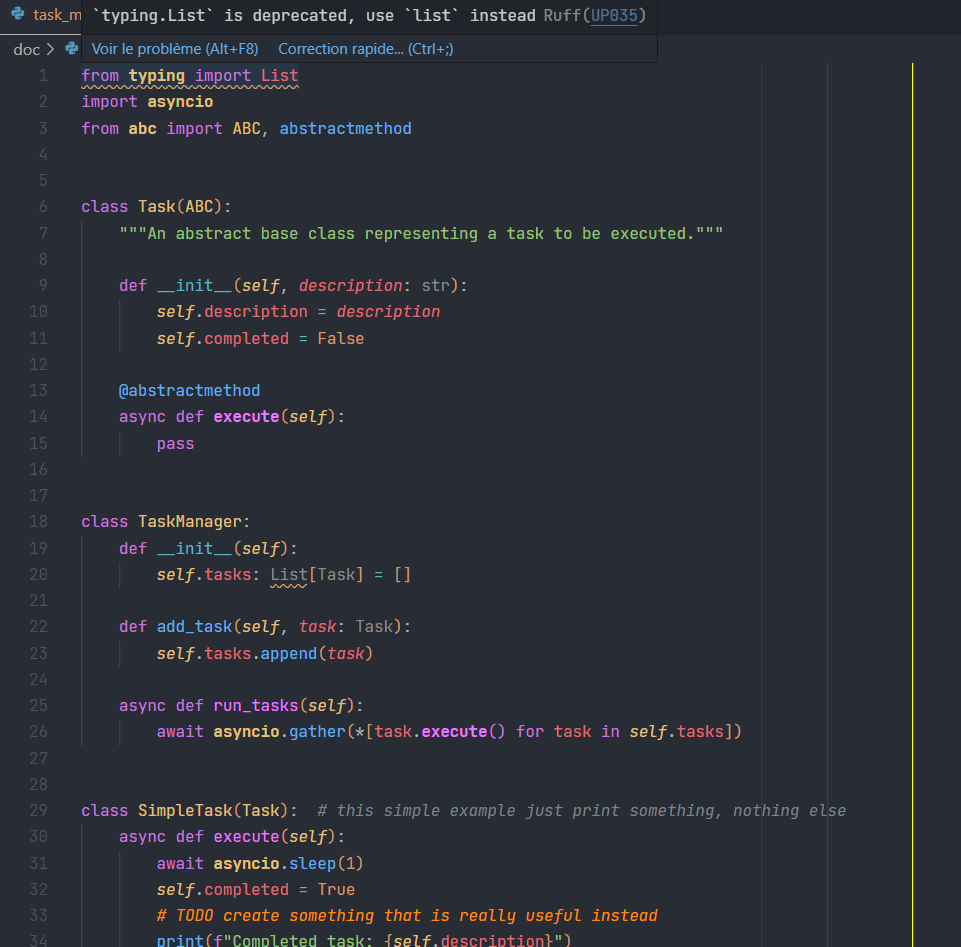

# VS Code Python Profile with complete settings

A python profile with useful settings and a full theme already configured. The theme used is `One Dark Pro` with some additional features.

[Screenshot](#screenshot) | [Configuration](#configuration) | [Extensions](#extensions) | [Theme](#theme) | [Key bindings](#key-bindings)

## Screenshot



## Configuration

Ligatures are disabled by default. To enable them, search for "ligature" in the settings then change the `editor.fontLigatures` setting to `true`.

### Ruff settings

Default settings (rules) are set in the `settings.json` file.
To override them, use a `pyproject.toml` file at the root of your project / workspace. This is the recommended way to configure those tools for any project, even without vscode. Here is an example of a `pyproject.toml` file for the Ruff linter:
<details>
<summary>pyproject.toml</summary>
<p>

```toml
[tool.ruff]
line-length = 88
fix=true

[tool.ruff.lint]
# https://beta.ruff.rs/docs/rules/
select = [
    "E",    # pycodestyle
    "F",    # pyflakes
    "N",    # pep8-naming
    "W",    # warnings (indentation, line length, etc.)
    "UP",   # pyupgrade
    "S",    # bandit
    "B",    # bugbear
    "COM",  # commas
    "C4",   # comprehensions
    "EM",   # error messages
    "RET",  # returns
    "RSE",  # raise statements
    "Q003", # quotes
    "SLF",  # private methods
    "SIM",  # simplify
    "TCH",  # type checking
    "PL",   # pylint
]

ignore = [
    "E501",   # line too long
    "F841",   # unused variable
    "RET505", # unnecessary `else` after `return` statement
    "COM812", # trailing comma (conflict with black formatter)
    "B905",   # no strict in zip
    "S311",   # random number generator not cryptographically strong
    "S101",   # use of assert detected
    "SLF001", # private member access
]

exclude = [
    ".bzr",
    ".direnv",
    ".eggs",
    ".git",
    ".git-rewrite",
    ".hg",
    ".mypy_cache",
    ".nox",
    ".pants.d",
    ".pytype",
    ".ruff_cache",
    ".svn",
    ".tox",
    ".venv",
    "__pypackages__",
    "_build",
    "buck-out",
    "build",
    "dist",
    "node_modules",
    "venv",
]

[tool.ruff.lint.extend-per-file-ignores]
"__init__.py" = ["F401"] # disable unused import rule in __init__.py files

[tool.ruff.lint.pydocstyle]
# https://beta.ruff.rs/docs/settings/#pydocstyle-convention
convention = "google"

[tool.ruff.flake8-quotes]
inline-quotes = "double"
multiline-quotes = "double"
docstring-quotes = "double"


[tool.ruff.lint.pylint]
max-args = 5

[tool.lint.pyright]
# deactivate pyright features that are already covered by ruff
# actually only enables type checking
# https://microsoft.github.io/pyright/#/configuration?id=diagnostic-rule-defaults for more info
typeCheckingMode = "basic"
reportGeneralTypeIssues = true
reportMissingTypeStubs = false
reportUndefinedVariable = false
reportUnusedVariable = false
reportUnusedClass = false
reportUnusedFunction = false
```
</p>
</details>

## Extensions

- `Python` - Python extension for Visual Studio Code.
- `Pylance` - Fast, feature-rich language support for Python, including the pyright static type checker.
- `Python environment manager` - Browse and manage all of your Python environments & packages from a single place.
- `Ruff` - Support for the [Ruff](https://beta.ruff.rs/docs/) linter and code formatter.
- `Python indent` - Correct python indentation in VS Code.
- `autoDocstring` - Automatically generates docstrings.
- `Even Better TOML` - TOML file support, for project config setup files like `pyproject.toml`.
- `Todo Tree` - Searches your workspace for comment tags like TODO and FIXME, and displays them in a tree view in the activity bar.
- `Better Comments` - Comment highlighting.
- `One Dark Pro` - Atom's iconic One Dark theme.

## Theme

The theme used is [`One Dark Pro`](https://github.com/Binaryify/OneDark-Pro). Some features are added in the `settings.json` file :

- Module import are bolded
- Abstract methods are bolded
- Everything related to annotation is of a different color (close to the comments one)
- async function are of a different color

## Key bindings

| Key | Action |
| --- | --- |
| `ctrl+enter` | Run the python file |
| `f4` | Go to the reference |
| `ctrl+t` | Toggle the terminal |
| `ctrl+shift t` | Open a new terminal |
| `ctrl+k t` | Clear the terminal |
